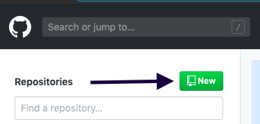
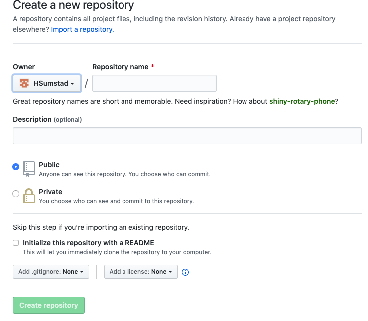
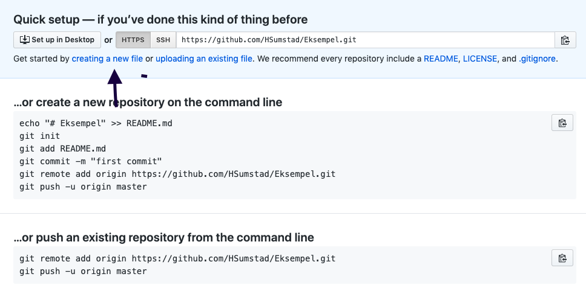
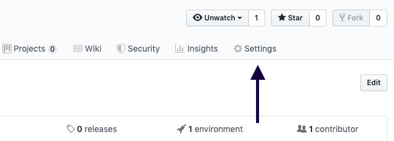
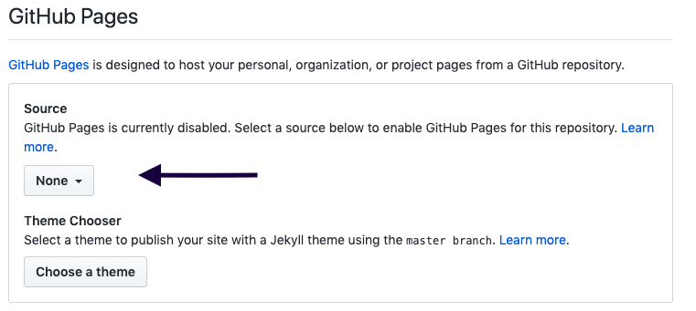

<!DOCTYPE html>
<html lang="en">
<head>
    <meta charset="UTF-8">
    <meta name="viewport" content="width=device-width, initial-scale=1.0">
    <meta http-equiv="X-UA-Compatible" content="ie=edge">
    <title>Document</title>
</head>
<body>
    <h1>Github</h1>
    <h3>1.Hvordan lage github bruker</h3>
        
Det første du gjør er å lage en bruker på github.
 
        
Du kan bruker denne linken forå komme på nettsiden: <a href="https://github.com/">github.com</a> Eller du kan søke opp github.com i nettleseren din.

        
Etter du har fylt inn infoboksene må du verifisere mailen din.

     
     

    <h3>2.Repository</h3> 
        
Det du skal gjøre, er å lage et repository. Her blir alle filene til nettsiden din lagret.

        
Trykk på "New" oppe i høyre hjørne for å lage et repository.

        
        
Etter det gir du det et navn. Det kan hete hva som helst.

        
Så velger du om det skal være offentlig eller privat.

        
    
     
     
        <h3>3.Laste opp koden</h3>
        
Neste du må gjør er å trykke på "creating a new file".

        
Også kaller du den for "index.md"

        
     
    <h3>4.Start et prosjekt</h3>
    
Det neste du skal gjøre er å kopiere hele koden din, og så skal du lime den inn under fila di, index.md.

    
Etter det blar du videre ned og trykker på commit new file. 
     
           
    
    <h3>5.Last opp websiden på Git-Hub</h3>
    
Trykk inn på repositoryen din og gå på settings.

    
    
Deretter skifter du navnet på repositoriet til: (brukernavnet ditt).github.io.

    
Så blar du ned til Git-Bub pages, trykk på none og bytt den med master branch

    
     
     
    
Du har nå publisert websiden din, og du kan åpne den med å trykke på linken under Git-Hub pages.

</body>
</html>
